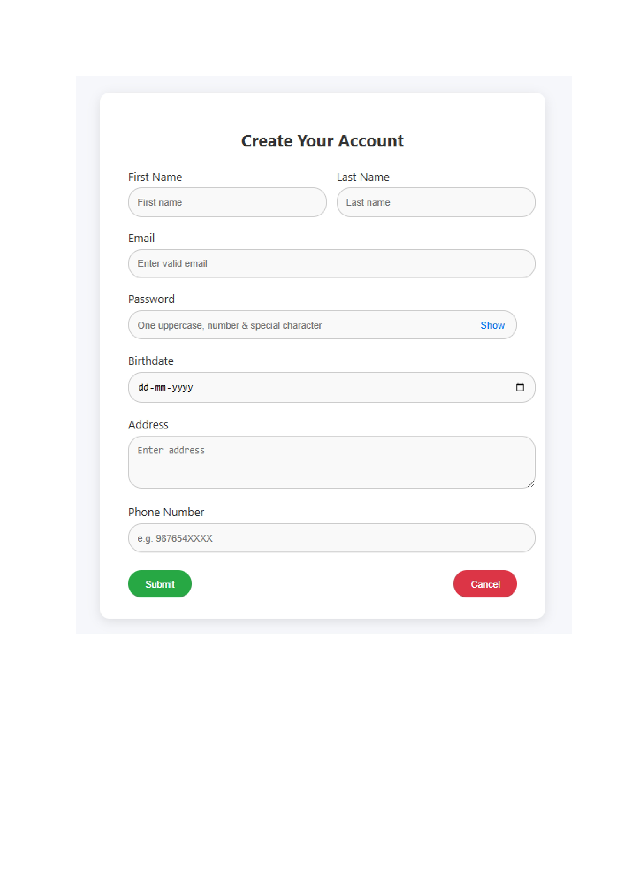
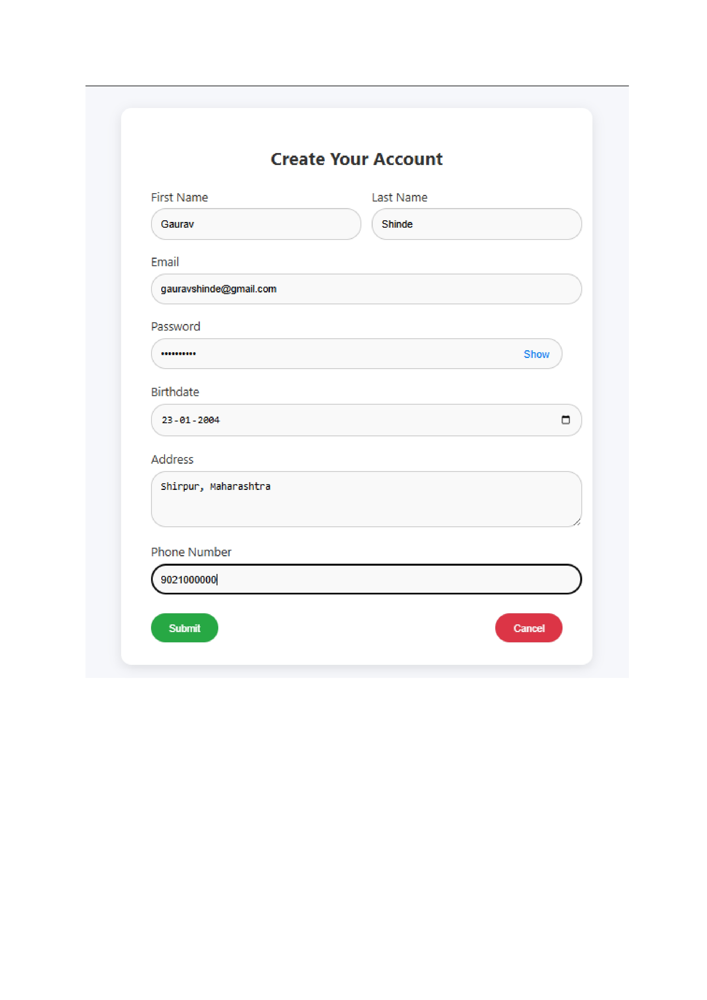

# User Registration Form

## Project Overview
A user registration form built using HTML, CSS, and JavaScript with field validation and responsive design.

## Features
- Interactive form with real-time validation
- Multiple input field types
- Client-side form validation
- Responsive design
- Success/Error message display

## Form Fields
1. **Full Name**
   - Required field
   - Only alphabets allowed
   - Min length: 3 characters

2. **Email Address**
   - Required field
   - Must follow email format (example@domain.com)
   - Email validation using regex

3. **Password**
   - Required field
   - Min length: 8 characters
   - Must contain:
     - At least one uppercase letter
     - At least one lowercase letter
     - At least one number
     - At least one special character

4. **Confirm Password**
   - Must match with password field

5. **Phone Number**
   - Required field
   - 10 digits only
   - Only numbers allowed

## Output Screenshots

### Form Interface


### Validation in Action


### Success Message


## Technologies Used
- HTML5
- CSS3
- JavaScript


## Validation Rules Implementation
```javascript
// Example validation rules
- Name: /^[A-Za-z\s]{3,}$/
- Email: /^[^\s@]+@[^\s@]+\.[^\s@]+$/
- Password: /^(?=.*\d)(?=.*[a-z])(?=.*[A-Z])(?=.*[^a-zA-Z0-9])(?!.*\s).{8,}$/
- Phone: /^\d{10}$/
```

## How to Use
1. Clone the repository
2. Open index.html in a web browser
3. Fill in the registration form
4. Submit and see validation in action

## Future Improvements
- Add backend integration
- Implement OTP verification
- Add password strength indicator
- Include social media registration options
