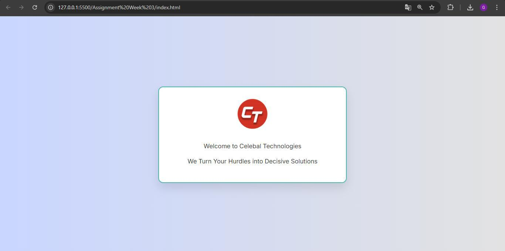
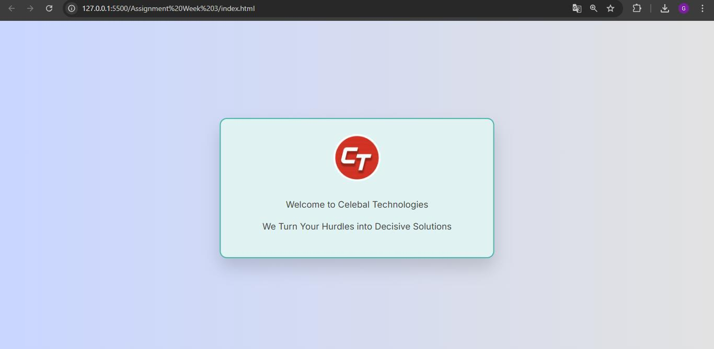

# Stylish Welcome Box Project

A simple yet visually appealing and responsive styled `
` element using semantic HTML and modern CSS to enhance user interaction and aesthetics.

## Preview

## Features & Improvements

- 🎨 **Modern UI Design**  
  - Gradient background  
  - Rounded corners and soft shadows  
  - Smooth scaling animation on hover  

- 🖱 **Interactive Hover Effects**  
  - Background color transition  
  - Box scaling for feedback and focus  

- 📱 **Responsive Layout**  
  - Centered and resizable container  
  - Mobile-friendly design with fluid width  

- 🧠 **Clean, Understandable Code**  
  - Written with beginner-to-intermediate developers in mind  
  - Uses semantic HTML and well-structured CSS  

## Implementation

The box is implemented using:
- ✅ HTML5 for semantic markup
- ✅ CSS3 for styling and transitions
- ✅ Google Fonts for enhanced typography

