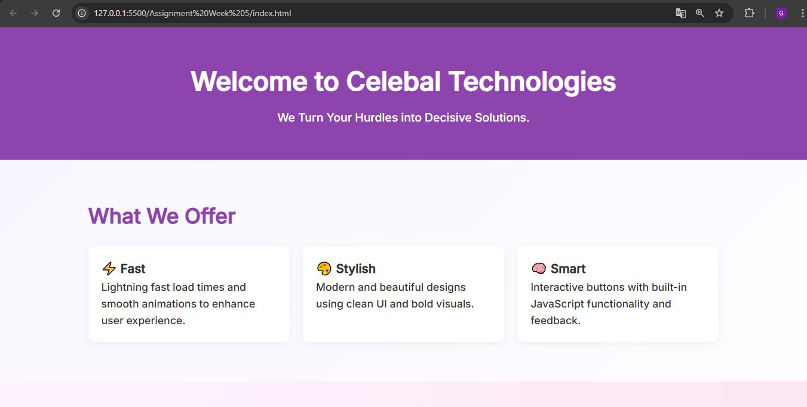
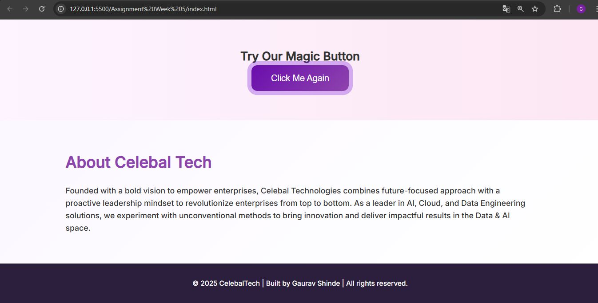

# Animated Button Assignment – Week 5

## Overview

This project demonstrates the creation of an interactive and visually appealing animated button using advanced HTML, CSS, and JavaScript techniques. The button features smooth transitions, gradient backgrounds, pulse animations, and dynamic interactivity, providing a modern UI component suitable for real-world applications. The layout is fully responsive and structured for clarity, including sections for features, about, and a footer.

## Features

- **Gradient Background:** Visually rich, layered color gradients for a modern look.
- **Animated Button:** Pulse animation, smooth hover and active effects, and engaging transitions.
- **JavaScript Interactivity:** Dynamic button label, enable/disable functionality, and sound feedback on click.
- **Responsive Design:** Mobile-first and fully adaptive layout for all device sizes.
- **Structured Layout:** Includes header, features, about, and footer sections for a real-world feel.

## Output

Below is a preview of the animated button output:

## License

This project is for educational purposes as part of the Celebal Technologies Summer Internship program.

## Acknowledgments

- Developed by Gaurav Shinde.
- Inspired by modern UI/UX trends and Celebal Technologies’ commitment