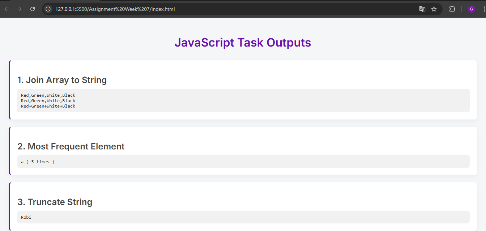
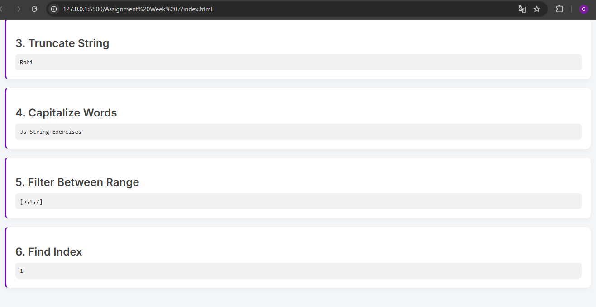

# Celebal Technologies – Assignment Week 7

## Overview

This assignment demonstrates a series of practical JavaScript solutions for common array and string manipulation tasks. The project showcases best practices in JavaScript, including clean code structure, modular functions, and interactive output rendering within a modern HTML layout. Developed as part of the Celebal Technologies Summer Internship program, the assignment emphasizes clarity, usability, and real-world applicability.

## Features

- **Array to String Conversion:** Join array elements using different separators.
- **Most Frequent Element:** Identify the most frequently occurring value in an array.
- **String Truncation:** Efficiently truncate strings to a specified length.
- **Word Capitalization:** Capitalize the first letter of each word in a string.
- **Range Filtering:** Filter array elements between two specified values.
- **Index Finder:** Locate the index of a specific value in an array.
- **Responsive UI:** Clean, modern, and responsive HTML layout for clear output presentation.

## Output

Below is a preview of the assignment output:

*Ensure `output.png` is present in the same folder as this README.*

## License

This project is for educational purposes as part of the Celebal Technologies Summer Internship program.

## Acknowledgments

- Developed by Gaurav Shinde.
- Inspired by Celebal Technologies’ commitment to excellence