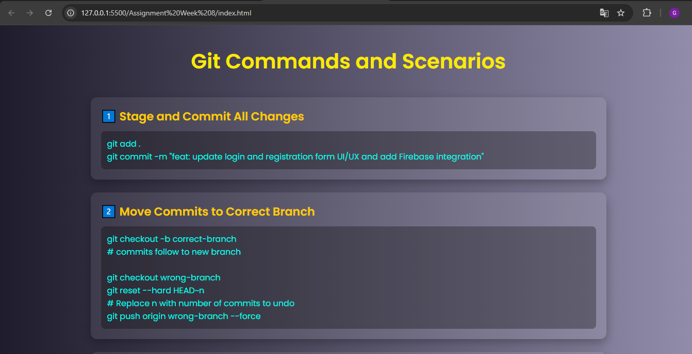

# Git Commands Explained – Assignment Week 8

## Overview

This project provides a visually engaging and interactive guide to essential Git commands and real-world scenarios. Designed as part of the Celebal Technologies Summer Internship program, the guide helps users understand and apply key Git workflows, including staging, committing, branching, resolving merge conflicts, and contributing to open source projects. The interface is modern, responsive, and easy to navigate, making it ideal for both beginners and experienced developers.

## Features

- **Comprehensive Git Scenarios:** Covers staging, committing, branching, merging, reverting, restoring files, and open source contributions.
- **Modern UI:** Clean, card-based layout with smooth animations and gradient backgrounds for enhanced readability.
- **Responsive Design:** Fully adaptive for desktops, tablets, and mobile devices.
- **Practical Examples:** Each scenario includes clear commands and explanations for real-world application.
- **Accessible:** Uses semantic HTML and high-contrast colors for improved accessibility.

## Getting Started

1. **Clone the repository:**
    ```bash
    git clone <repository-url>
    ```
2. **Navigate to the project directory:**
    ```bash
    cd "Assignment Week 8"
    ```
3. **Open `index.html` in your browser** to view the interactive Git command guide.

No additional dependencies or build steps are required.

## Output

Below is a preview of the project interface:




## License

This project is for educational purposes as part of the Celebal Technologies Summer Internship program.

## Acknowledgments

- Developed by Gaurav Shinde.
- Inspired by Celebal Technologies’ commitment to excellence