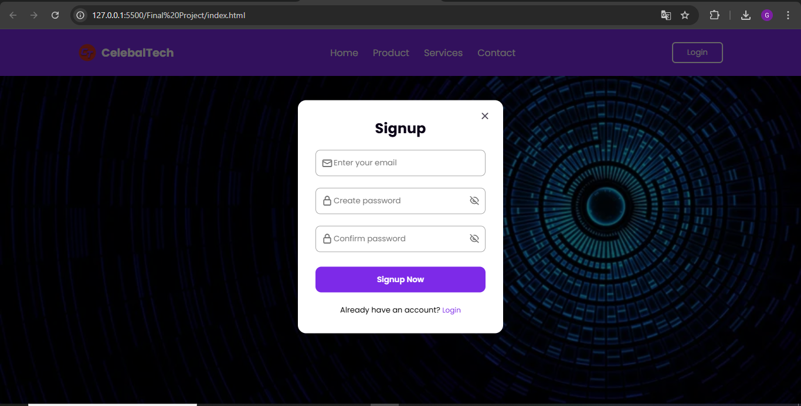
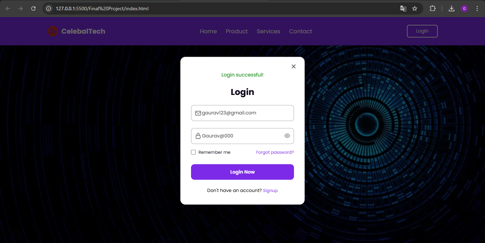
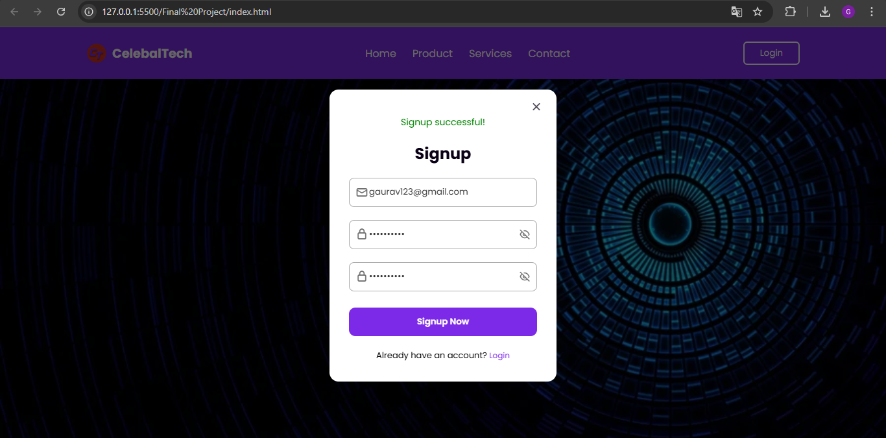

# CelebalTech – Login & Registration Portal

## Overview

This project is a modern, responsive Login & Registration portal designed for Celebal Technologies. It features a visually appealing interface, robust form validation, and seamless user experience. Built with HTML, CSS, and JavaScript, the portal demonstrates advanced front-end techniques including modal forms, password visibility toggling, dynamic feedback messages, and adaptive layouts. The design reflects Celebal Technologies’ commitment to innovation and user-centric digital solutions.

## Features

- **Modern UI:** Clean, professional layout with a fixed header and branded navigation.
- **Responsive Design:** Fully adaptive for desktops, tablets, and mobile devices.
- **Login & Signup Modal:** Interactive modal forms for user authentication.
- **Password Visibility Toggle:** Easily show/hide password fields for convenience.
- **Dynamic Feedback:** Success messages for login and signup actions.
- **Form Validation:** Required fields and input checks for robust user experience.
- **Accessible:** Semantic HTML and color contrast for improved accessibility.
- **Branded Experience:** Includes CelebalTech logo and themed color palette.

## Getting Started

1. **Clone the repository:**
    ```bash
    git clone <repository-url>
    ```
2. **Navigate to the project directory:**
    ```bash
    cd "Final Project"
    ```
3. **Open `index.html` in your browser** to view and interact with the portal.

No additional dependencies or build steps are required.

## Output

Below are screenshots showcasing the portal’s interface and features:

### Home Page with Branded Header



### Login Modal



### Registration Modal




```

## License

This project is for educational purposes as part of the Celebal Technologies Summer Internship program.

## Acknowledgments

- Developed by Gaurav Shinde.
- Inspired by Celebal Technologies’ vision for digital transformation and excellence in software